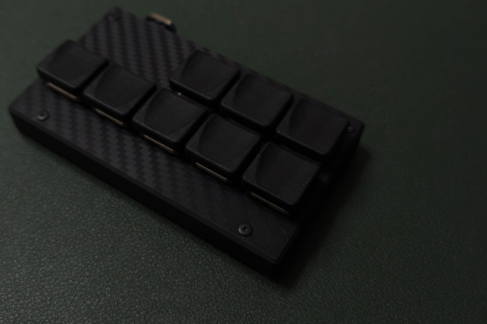

# Binary with keymap (without mass storage) を何とかする



[キーケット 2025](https://keyket.jp/tokyo-2025)で、Joker8というマクロパッドを購入した。購入後、[Joker8 ビルドガイド（組立手順説明書）](https://blog.alglab.net/archives/joker8-build-guide/)を確認し、ファームウェアとしてKermiteとPRK Firmwareがサポートされていることを知った。Kermiteでは自分の求める機能を実装できないと判断し、PRK Firmwareを実装することに決めた。Joker8のビルドガイドで紹介されていたPRK Firmwareの実装方法だと、マクロパッドがUSBマスストレージとして認識され、ここにキーマップファイル（keymap.rb）を書き込むことになる。

今回は、USBマスストレージとして認識されると困る環境での使用を考慮して、[Binary with keymap (without mass storage)](https://github.com/picoruby/prk_firmware/wiki/Building-a-binary#binary-with-keymap-without-mass-storage)を参考にバイナリにキーマップファイルを入れ込んでビルドする方法を試みた。しかし、バージョンが進んでファイル内容に変更があったのか、自分の環境に問題があるのか、ビルドエラーとなった。エラー内容を調べて、なんとかビルドできる環境を整えたので、備忘録として残しておく。

## キーマップファイル（keymap.rb）の作成

オリジナルの[Joker8/XIAO RP2040](https://github.com/alg0002/PRK_Firmware_keymap_rb/tree/4ad4c768a490d8cd699337ef92401a99c321e23d/Joker8/XIAO%20RP2040)の keymap.rbをお手本にして、[prk\_firmware Wiki](https://github.com/picoruby/prk_firmware/wiki/)を調べながら、自分用のJoker8キーマップファイルを作成した。主に参照したのは、下記ページ。

+ [Keycodes · picoruby/prk\_firmware Wiki](https://github.com/picoruby/prk_firmware/wiki/Keycodes)
+ [Layers and mode key · picoruby/prk\_firmware Wiki](https://github.com/picoruby/prk_firmware/wiki/Layers-and-mode-key)
+ [Composite key · picoruby/prk\_firmware Wiki](https://github.com/picoruby/prk_firmware/wiki/Composite-key)
+ [Keyboard macro · picoruby/prk\_firmware Wiki](https://github.com/picoruby/prk_firmware/wiki/Keyboard-macro)

なお、Binary with keymap (without mass storage)によるビルドは時間がかかるので、キーマップファイル（keymap.rb）の作成や試行錯誤は、[Joker8 ビルドガイド（組立手順説明書）](https://blog.alglab.net/archives/joker8-build-guide/)に記載されているPRK Firmwareの実装方法でやった方がよい。

## 【修正1】用ファイル（mod_Rakefile）の作成

[picoruby/prk\_firmware](https://github.com/picoruby/prk_firmware)のルートディレクトリにある`Rakefile`の89行目から110行目までを下記に変更して、置換用の`mod_Rakefile`を作成した。Grok君にエラー内容を確認してもらい、修正しました。

```ruby
def with_keymap(board, keyboard_name)   # 引数を追加
  ENV['BOARD'] = board
  ENV['PICORUBY_NO_MSC'] = '1'
  ENV['WITH_KEYMAP_DIR'] = "keyboards/#{keyboard_name}/"  # 未定義のargsを削除
  Rake::Task[:all].invoke
end

desc "build PRK Firmware inclusive of keymap.rb (without mass storage) for RP2040"
task :build_with_keymap_pico, ['keyboard_name'] do |_t, args|
  unless args.keyboard_name
    raise "Argument `keyboard_name` missing.\nUsage: rake build_with_keymap_pico[prk_meishi2]"  # 引数を追加
  end
  with_keymap('pico', args.keyboard_name)  # args.keyboard_name を with_keymap に渡すように修正
end

desc "build PRK Firmware inclusive of keymap.rb (without mass storage) for RP2350 (Pico2)"
task :build_with_keymap_pico2, ['keyboard_name'] do |_t, args|
  unless args.keyboard_name
    raise "Argument `keyboard_name` missing.\nUsage: rake build_with_keymap_pico2[prk_meishi2]"  # 引数を追加
  end
  with_keymap('pico2', args.keyboard_name)  # args.keyboard_name を with_keymap に渡すように修正
end
 ```

## Binary with keymap (without mass storage)でのビルド環境構築（WSL2 Ubuntu用）

公式サイトの手順を参考に、エラー回避手順も含めて整理した。ここで示す手順は、作成したキーマップファイル（keymap.rb）と修正1でRakefileを置き換えるファイル（mod_Rakefile）を ~/my_prkフォルダに配置しておくことを前提としている。

+ [Building a binary · picoruby/prk\_firmware Wiki](https://github.com/picoruby/prk_firmware/wiki/Building-a-binary)


```bash
# my_prk
#  ├─ keymap.rb  # 自前のキーマップファイル
#  └─ mod_Rakefile # 修正1でRakefileを置き換えるファイル

# 準備
sudo apt update
sudo apt install -y autoconf patch build-essential rustc libssl-dev libyaml-dev libreadline6-dev zlib1g-dev libgmp-dev libncurses5-dev libffi-dev libgdbm6 libgdbm-dev libdb-dev uuid-dev cmake python3 gcc-arm-none-eabi libnewlib-arm-none-eabi libstdc++-arm-none-eabi-newlib zip

# ruby周辺のインストール
cd ~
git clone https://github.com/rbenv/rbenv.git ~/.rbenv
~/.rbenv/bin/rbenv init
source ~/.bashrc
git clone https://github.com/rbenv/ruby-build.git "$(rbenv root)"/plugins/ruby-build
# 現在インストールできる安定バージョンの確認
rbenv install --list
# 最新の3.x.xをインストール
rbenv install 3.4.2
rbenv global 3.4.2

# pico周辺のインストール
cd ~
mkdir pico

cd pico
git clone https://github.com/raspberrypi/pico-sdk.git
git clone https://github.com/raspberrypi/pico-examples.git
git clone https://github.com/raspberrypi/pico-extras.git
echo 'export PICO_SDK_PATH="$HOME/pico/pico-sdk"' >> ~/.bashrc
echo 'export PICO_EXAMPLES_PATH="$HOME/pico/pico-examples"' >> ~/.bashrc
echo 'export PICO_EXTRAS_PATH="$HOME/pico/pico-extras"' >> ~/.bashrc
source ~/.bashrc

cd pico-sdk
# 最後のビルド（rake）時に、pico-sdkを2.1.0にしろと怒られる。
# PICO_SDK_TAGに2.1.0が指定されていたので、現状の2.1.1に変更してみたが、やはり2.1.0にしろと怒られる。
# というわけで、この時点で pico-sdk を2.1.0に戻しておくことにした。
git pull
git checkout 2.1.0
git submodule update --init --recursive

cd tools
git clone -b master https://github.com/raspberrypi/picotool.git

cd picotool
mkdir build

cd build
cmake ..
make
sudo make install

# prk_firmwareのインストール
cd ~
git clone --recursive https://github.com/picoruby/prk_firmware.git

cd ~/prk_firmware
rake setup

# 任意のフォルダ（例：my_keyboard）フォルダに自前キーボード用に作成したkeymap.rbを配置
mkdir -p keyboards/my_keyboard
cp ~/my_prk/keymap.rb ~/prk_firmware/keyboards/my_keyboard/keymap.rb

# 【修正1】Rakefileの修正
### 修正済みのmod_RakefileでRakefileを上書き
cp ~/my_prk/mod_Rakefile ~/prk_firmware/Rakefile

# 【修正2】picoruby.cの修正
# mrc_freeだと引数が2つ必要でエラーとなっていた。freeは引数が1つで済むので、こちらに変更
### 588行目を'mrc_free(source)'から'free(source)'に変更
sed -i '588s/mrc_free(source)/free(source)/' "$HOME/prk_firmware/lib/picoruby/mrbgems/picoruby-bin-picoruby2/tools/picoruby/picoruby.c"

# 上記2つの修正が済んだらビルド作業に進む
cd ~/prk_firmware
rake build_with_keymap_pico[my_keyboard]
# 以上で、ファームウェアが ~/prk_firmware/keyboards/my_keyboard/build_pico/ に生成される

# 主要ディレクトリ構成
prk_firmware
 ├─ CMakeLists.txt
 ├─ Rakefile
 └─ keyboards
      └─ my_keyboard
           ├─ keymap.rb  # 自前のキーマップファイル
           └─ build_pico
                └─ prk_firmware-pico-NO_MSC-[PRK_VERSION]-[PRK_BUILDDATE]-[PRK_REVISION].uf2 # 作成されるファームウェア
```
